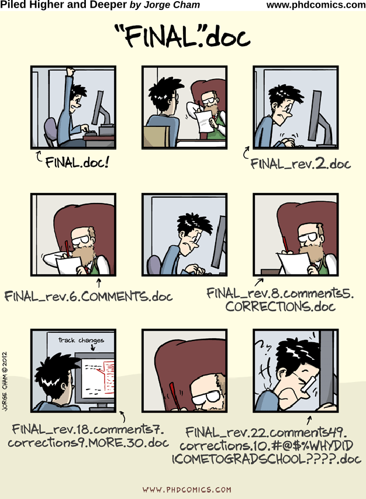
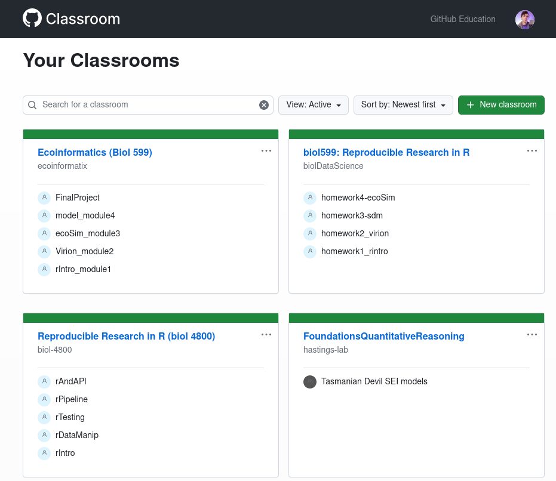
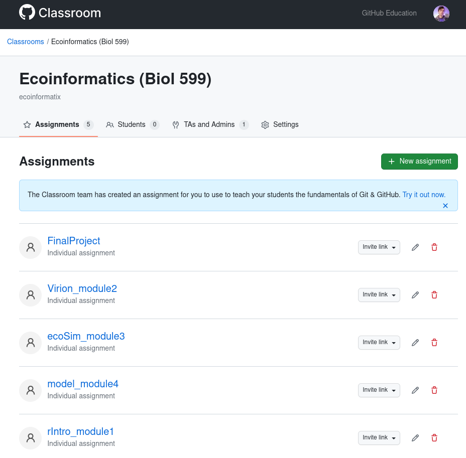
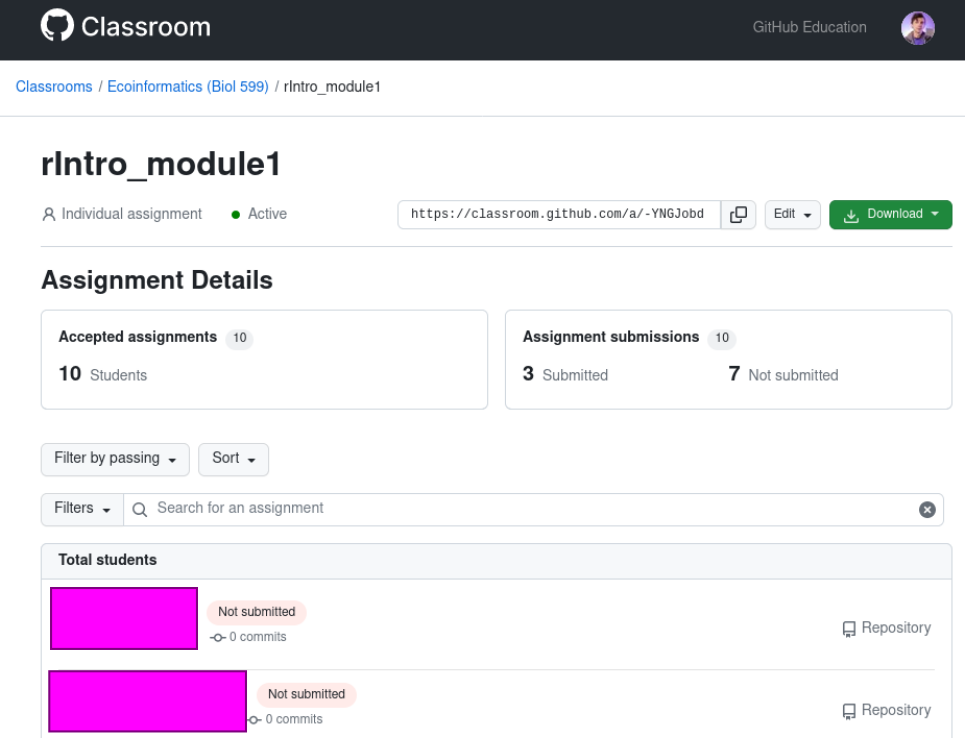
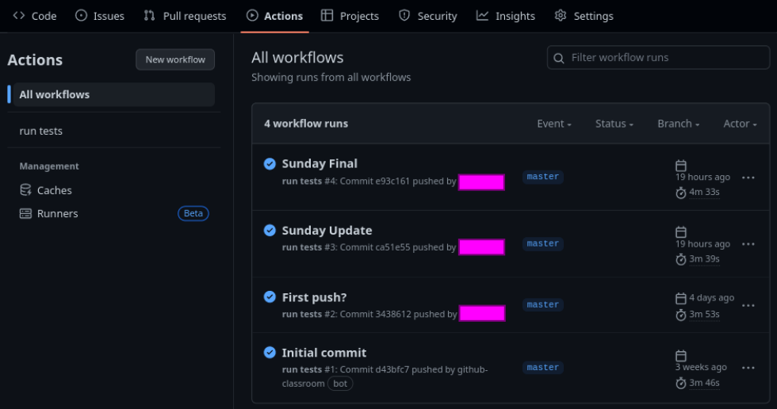
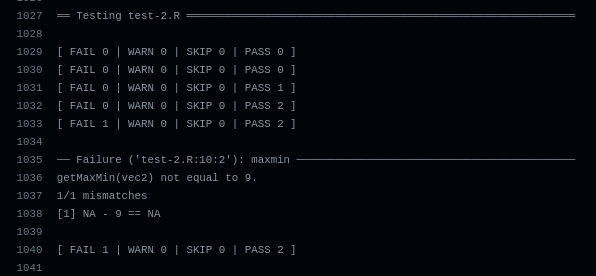
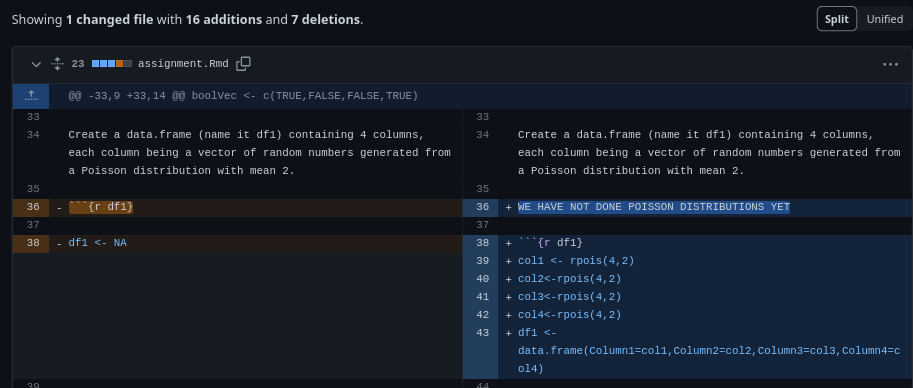
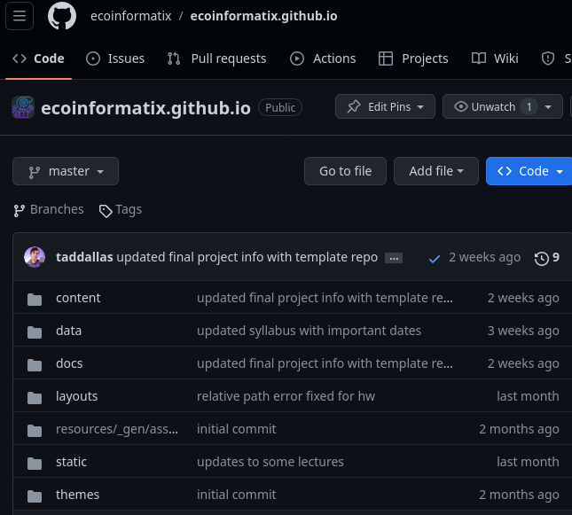

<style type="text/css">
.main-container {
  max-width: 800px;
  margin-left: auto;
  margin-right: auto;
}
</style>

```{r setup, include=FALSE} 
knitr::opts_chunk$set(warning = FALSE, message = FALSE) 
```


```{r load_packages, message=FALSE, warning=FALSE, include=FALSE} 
library(fontawesome)
```


## What is `git` used for? `r fa("github", fill='dodgerblue')`

<div class="columns-2">
  {width="100%"}

  - Version control
  - Keep files organized
  - Know where your files are 
  - Be able to jump between file versions 
</div>


## What is GitHub? 

<div class="columns-2">
  {width="100%"}

  - Online platform for `git` projects
  - Enables code collaboration, issue tracking, etc.
  - Really great teaching tool!
</div>


## GitHub as a teaching tool? 

+ All course material, including the [website itself](https://ecoinformatix.github.io/syllabus/), is on GitHub
+ Students (and anyone) has access
+ Allows for posting of code, text, video, etc. etc. 
+ Is basically a free Learning Mgmt System (but not Blackboard)
+ ADA compliant (output lecture and code in multiple formats)


## How does GitHub Classroom help? 


<div class="columns-2">
  {width="100%"}

<br>

  + teach <span style="color: forestgreen;"> proper version control </span>
  + see where students <span style="color: firebrick;"> struggle </span>
  + provide <span style="color: dodgerblue;"> timely feedback </span>
  
</div>


## What issues does the use of GitHub Classroom address? 

+ A <span style="color: brown;"> history </span> of your courses taught
+ All your materials <span style="color: forestgreen;"> in one place  </span>
+ Clear <span style="color: purple;"> deadlines </span>
+ Track student <span style="color: dodgerblue;"> progress </span>
+ Provide immediate <span style="color: red;"> automated feedback </span>
+ Gives instructor a look at `muddy points` 


---

### A <span style="color: brown;"> history </span> of your courses taught

```{r, echo=FALSE, out.width="80%", fig.align="center"}

```


---

### All your materials <span style="color: forestgreen;"> in one place  </span>

```{r, echo=FALSE, out.width="80%", fig.align="center"}

```


---

### Clear <span style="color: purple;"> deadlines </span>

```{r, echo=FALSE, out.width="80%", fig.align="center"}

```


---

### Track student <span style="color: dodgerblue;"> progress </span>

```{r, echo=FALSE, out.width="100%", fig.align="center"}

```


--- 

### Provide immediate <span style="color: red;"> automated feedback </span>


```{r, echo=FALSE, out.width="100%", fig.align="center"}

```


--- 

### Gives instructor a look at `muddy points` 

```{r, echo=FALSE, out.width="100%", fig.align="center"}

```


## This is not limited to ...

+ coding courses!
  + Students <span style="color: firebrick;"> do not </span> need to use `git`

+ this semester!
  + Re-work course material based on what worked well `r fa("recycle", fill='forestgreen')`

+ this university! 
  + Reach students across the world `r fa("globe", fill='dodgerblue')`


<br> 

<center><font size="10"> https://classroom.github.com/ </font></center>


---

<center>
### https://ecoinformatix.github.io 
</center>
```{r, echo=FALSE, out.width="65%", fig.align="center"}

```
<center>
### https://github.com/ecoinformatix/ecoinformatix.github.io
</center>


## Thank you 

<br> 


`r fa("sack-dollar", fill='forestgreen')` University of South Carolina, NSF

`r fa("user", fill='purple')` https://taddallas.github.io 

`r fa("twitter", fill='dodgerblue')` @taddallas 

`r fa("github", fill='black')` https://github.com/taddallas 

<br> 

<center> `r fa("person-chalkboard", fill='hotpink')`  https://github.com/taddallas/ocktoberbest2023 </center>
<center> `r fa("computer", fill='hotpink')`  https://taddallas.github.io/ocktoberbest2023/ </center>


